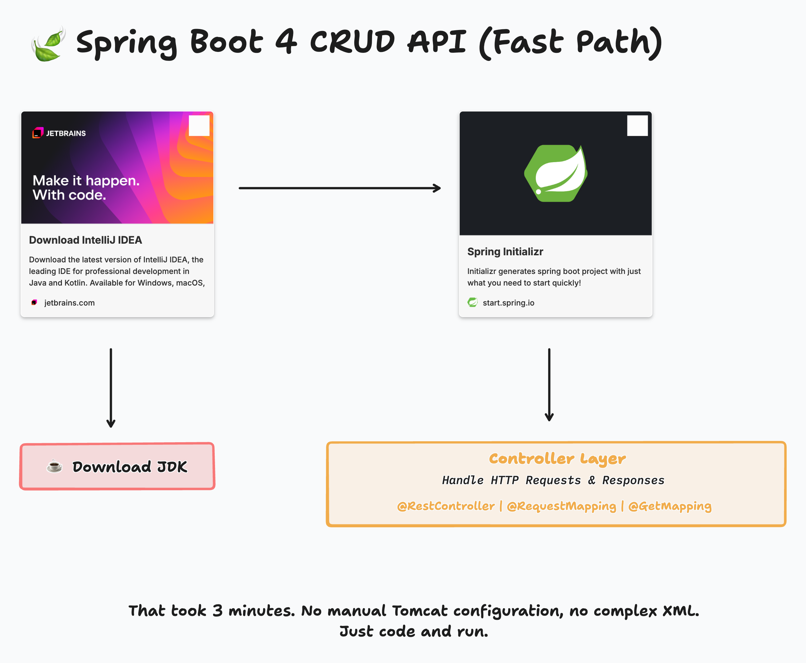

# Meetup

A Spring Boot 4 CRUD API demo for managing tech meetup groups.

## Fast Path



Getting started with Spring Boot has never been easier. In Part 1 of this demo, we build a complete CRUD API in 
minutes using in-memory storage. No manual Tomcat configuration, no complex XML, no database setup. Just code and run.

### Getting Started

#### 1. Download IntelliJ IDEA

Download the latest version of [IntelliJ IDEA](https://www.jetbrains.com/idea/) - the leading IDE for professional 
development in Java and Kotlin. Available for Windows, macOS, and Linux. 
There's now a single version that includes everything you need.

#### 2. Download a JDK

IntelliJ IDEA can download a JDK for you. When you open the project, go to **File > Project Structure > SDK** and 
select a JDK 25+ to download, or use one you already have installed.

#### 3. Generate a Project with Spring Initializr

Head to [start.spring.io](https://start.spring.io) to generate a Spring Boot project with just what you need to start 
quickly. Select:

- Spring Boot 4.0.0
- Java 25
- Spring Web dependency

#### 4. Create a Controller

Create a simple REST controller to handle HTTP requests:

```java
@RestController
public class HomeController {
    @GetMapping("/")
    public String home() {
        return "Hello World!";
    }
}
```

That's it - you're up and running in minutes.

### Running the Application

**From IntelliJ IDEA:**
Open `MeetupApplication.java` and click the green play button next to the `main` method, or right-click the file and select "Run".

**From the command line:**
```bash
./mvnw spring-boot:run
```

The application starts on `http://localhost:8080`.

**Try it in your browser:**
Open [http://localhost:8080/api/groups](http://localhost:8080/api/groups) to see the list of groups as JSON.

### API Endpoints

| Method | Endpoint | Description |
|--------|----------|-------------|
| GET | `/api/groups` | Get all groups |
| GET | `/api/groups/{id}` | Get group by ID |
| POST | `/api/groups` | Create a new group |
| PUT | `/api/groups/{id}` | Update an existing group |
| DELETE | `/api/groups/{id}` | Delete a group |

### Sample Requests

See [meetups.http](./meetups.http) for sample requests you can run with your IDE's HTTP client or the REST Client extension.

### Pre-loaded Data

The application starts with four Cleveland tech groups:

1. Cleveland Java User Group
2. Cleveland React Meetup
3. Cleveland Python User Group
4. Cleveland Tech Slack

### Architecture

This project uses a **package by feature** approach rather than package by layer:

```
dev.danvega.meetup
├── MeetupApplication.java
├── HomeController.java
└── group/
    ├── Group.java
    └── GroupController.java
```

In a package by layer approach, you'd have separate `controllers/`, `models/`, and `services/` packages. The problem? 
Everything needs to be `public` so classes can access each other across packages. This breaks encapsulation.

With package by feature, all related classes live together. Classes can use package-private (default) visibility, 
keeping implementation details hidden and only exposing what's truly needed. 
This is how Java applications are meant to be built.

For larger applications, consider [Spring Modulith](https://spring.io/projects/spring-modulith) which takes this further with explicit module boundaries and verification. We'll cover that in a future demo.

---

## Full Path (Detailed CRUD Application)

*Coming in Part 2* - A more full-featured implementation with database persistence, validation, error handling, and more.
